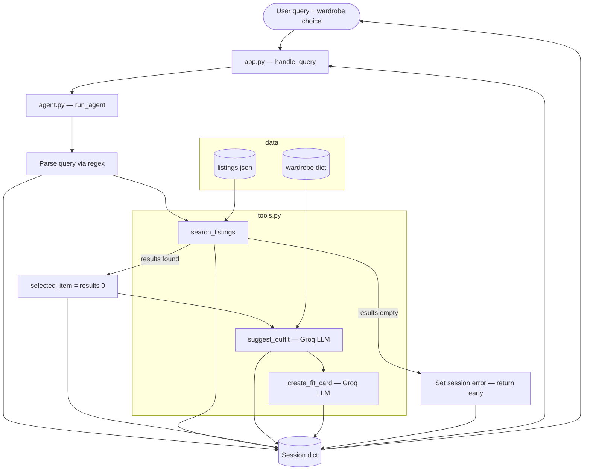

# FitFindr — planning.md

> Complete this document before writing any implementation code.
> Your spec and agent diagram are what you'll use to direct AI tools (Claude, Copilot, etc.) to generate your implementation — the more specific they are, the more useful the generated code will be.
> Your planning.md will be reviewed as part of your submission.
> Update it before starting any stretch features.

---

## Tools

List every tool your agent will use. For each tool, fill in all four fields.
You must have at least 3 tools. The three required tools are listed — add any additional tools below them.

### Tool 1: search_listings

**What it does:**
Searches the 40 mock listings in `data/listings.json` for items that match the user's keyword description, optional size, and optional max price. Results are ranked by keyword relevance (not just filtered) so the best match appears first.

**Input parameters:**
- `description` (str): Keywords describing what the user wants (e.g., `"vintage graphic tee"`). Matched against each listing's `title`, `description`, and `style_tags`.
- `size` (str | None): Size filter, or `None` to skip. Case-insensitive substring match against the listing's `size` field (e.g., `"M"` matches `"S/M"` or `"M/L"`).
- `max_price` (float | None): Maximum price inclusive, or `None` to skip. Listings with `price > max_price` are excluded.

**What it returns:**
A `list[dict]` of matching listing dicts, sorted by relevance score (highest first). Each dict contains all fields from the dataset: `id`, `title`, `description`, `category`, `style_tags`, `size`, `condition`, `price`, `colors`, `brand`, `platform`.

Scoring logic:
1. Tokenize `description` into lowercase words (split on whitespace; ignore words shorter than 3 characters).
2. For each listing, count how many tokens appear in `title`, `description`, or any `style_tags` entry (case-insensitive).
3. Exclude listings with score 0.
4. Sort by score descending; ties broken by lower price first.

Returns `[]` (empty list, no exception) when no listings pass all filters or have score > 0.

**What happens if it fails or returns nothing:**
The tool itself returns `[]`. The **agent** (not the tool) sets `session["error"]` to a helpful message and returns the session early. It does **not** call `suggest_outfit` or `create_fit_card`. Example agent message: *"No listings matched your search. Try broadening your keywords (e.g., 'graphic tee' instead of 'vintage band tee'), raising your max price, or removing the size filter."*

---

### Tool 2: suggest_outfit

**What it does:**
Given a specific thrift listing the user is considering and their existing wardrobe, calls Groq (`llama-3.3-70b-versatile`) to suggest 1–2 complete outfit combinations. When the wardrobe has items, suggestions must reference named pieces from the wardrobe by name. When the wardrobe is empty, it offers general styling advice for the new item instead.

**Input parameters:**
- `new_item` (dict): A single listing dict from `search_listings` (the agent passes `session["selected_item"]`). Must include at least `title`, `description`, `style_tags`, `category`, and `colors`.
- `wardrobe` (dict): User's wardrobe with an `items` key containing a list of wardrobe item dicts. Each item has `id`, `name`, `category`, `colors`, `style_tags`, and optional `notes`. May be empty (`items: []`).

**What it returns:**
A non-empty `str` containing 1–2 outfit suggestions in plain English (2–6 sentences). Each suggestion should name specific wardrobe pieces when available, describe how to style the new item (tucking, layering, rolling sleeves, etc.), and capture the overall vibe.

**What happens if it fails or returns nothing:**
- **Empty wardrobe:** The tool does not fail — it calls the LLM with a prompt asking for general pairing ideas (what categories of items work, what vibe the piece suits, starter outfit formulas). Returns a useful string like *"This faded band tee works great with wide-leg denim and chunky sneakers for a 90s grunge look..."*
- **LLM/API error:** Return a descriptive error string (e.g., *"Could not generate outfit suggestions right now. Try again in a moment."*) rather than raising an exception. The agent stores this in `session["outfit_suggestion"]` and still attempts `create_fit_card` unless the string is clearly an error — if the outfit string is empty, `create_fit_card` handles it on its own.

---

### Tool 3: create_fit_card

**What it does:**
Calls Groq (`llama-3.3-70b-versatile`, temperature ~0.9) to generate a short, casual, shareable outfit caption — the kind someone would post on Instagram or TikTok about a thrift find. Mentions the item name, price, and platform naturally once each.

**Input parameters:**
- `outfit` (str): The outfit suggestion string returned by `suggest_outfit` (stored in `session["outfit_suggestion"]`).
- `new_item` (dict): The listing dict for the thrifted item (`session["selected_item"]`). Used for `title`, `price`, and `platform` in the prompt.

**What it returns:**
A `str` of 2–4 sentences usable as a social caption. Tone: casual, first-person, authentic — not a product listing. Outputs should vary across runs for the same inputs (achieved via higher temperature).

**What happens if it fails or returns nothing:**
- **Empty or whitespace-only `outfit`:** Return immediately without calling the LLM: *"Can't create a fit card — no outfit suggestion was provided. Run outfit styling first."*
- **LLM/API error:** Return a descriptive error string rather than raising an exception.

---

### Additional Tools (if any)

None planned for the required submission. Stretch feature candidates (document here before implementing):
- `compare_price(item)` — estimate if price is fair vs. similar listings
- Retry-with-loosened-constraints logic inside the planning loop (not a separate tool)

---

## Planning Loop

**How does your agent decide which tool to call next?**

The agent runs a **conditional linear loop** in `run_agent()`. It does not call all three tools unconditionally — each step checks the result of the previous step before proceeding.

**Query parsing (Step 2):** Use regex (no LLM call) to extract parameters from the natural-language query:
- `max_price`: match patterns like `under $30`, `under 30`, `max $30`, `$30 or less` → extract float `30.0`
- `size`: match `size M`, `size 8`, `in size L`, etc. → extract size string (case preserved, compared case-insensitively later)
- `description`: the full query with price/size phrases stripped out, trimmed. Fallback: if description is empty after stripping, use the original query.

Store in `session["parsed"]` as `{"description": str, "size": str | None, "max_price": float | None}`.

**Conditional branches:**

```
1. Initialize session with _new_session(query, wardrobe)

2. Parse query → session["parsed"]

3. Call search_listings(parsed["description"], parsed["size"], parsed["max_price"])
   → store in session["search_results"]

   IF session["search_results"] is empty:
       SET session["error"] = helpful no-results message (mention loosening price/size/keywords)
       RETURN session early
       (do NOT call suggest_outfit or create_fit_card)

4. SET session["selected_item"] = session["search_results"][0]   # top match

5. Call suggest_outfit(session["selected_item"], session["wardrobe"])
   → store in session["outfit_suggestion"]
   (always proceed — empty wardrobe is handled inside the tool)

6. Call create_fit_card(session["outfit_suggestion"], session["selected_item"])
   → store in session["fit_card"]

7. RETURN session
```

**When is the agent done?**
After Step 7 on success, or after Step 3 on search failure. There is no re-planning loop or multi-turn tool selection — the agent makes one pass with an early exit on empty search results.

**What changes behavior:**
- Empty `search_results` → early termination; only `session["error"]` is populated
- Non-empty `search_results` → full pipeline runs; `selected_item` flows to both LLM tools
- Empty vs. populated wardrobe → changes the *content* of `suggest_outfit` output, not whether it is called

---

## State Management

**How does information from one tool get passed to the next?**

All state lives in a single **session dict** returned by `_new_session()` and updated in place throughout `run_agent()`. No global variables; each call to `run_agent()` gets a fresh session.

| Session key | Set when | Used by |
|-------------|----------|---------|
| `query` | Session init | Reference only (display/debug) |
| `parsed` | After query parsing | Input to `search_listings` |
| `search_results` | After `search_listings` | Source for `selected_item`; empty check for early exit |
| `selected_item` | After picking top result | Passed to `suggest_outfit` and `create_fit_card` |
| `wardrobe` | Session init (from UI or test) | Passed to `suggest_outfit` |
| `outfit_suggestion` | After `suggest_outfit` | Passed to `create_fit_card` |
| `fit_card` | After `create_fit_card` | Final output for UI |
| `error` | On search failure (or empty query in UI) | Checked first by `handle_query()` in `app.py` |

**Data flow example (happy path):**
```
query → parsed → search_listings → search_results[0] → selected_item
                                                              ↓
                                              suggest_outfit(selected_item, wardrobe)
                                                              ↓
                                                    outfit_suggestion
                                                              ↓
                                              create_fit_card(outfit_suggestion, selected_item)
                                                              ↓
                                                         fit_card
```

The Gradio handler reads the completed session and maps:
- `selected_item` → formatted listing text (panel 1)
- `outfit_suggestion` → panel 2
- `fit_card` → panel 3
- If `error` is set → error in panel 1, empty strings in panels 2 and 3

---

## Error Handling

For each tool, describe the specific failure mode you're handling and what the agent does in response.

| Tool | Failure mode | Agent response |
|------|-------------|----------------|
| search_listings | No results match the query | Set `session["error"]` to: *"No listings found for '[description]' (size: [size or 'any'], max price: $[price or 'none']). Try using broader keywords like 'graphic tee' or 'vintage top', increasing your budget, or dropping the size filter."* Return session immediately. `outfit_suggestion` and `fit_card` stay `None`. |
| suggest_outfit | Wardrobe is empty | Tool handles internally — returns general styling advice (not an error). Agent continues to `create_fit_card` normally. UI panel 2 shows general pairing ideas instead of wardrobe-specific combos. |
| create_fit_card | Outfit input is missing or incomplete | Tool returns: *"Can't create a fit card — no outfit suggestion was provided. Run outfit styling first."* Agent stores this string in `session["fit_card"]`. UI panel 3 shows the error message. |

**Additional UI-level guard (app.py):**
| Failure mode | Agent response |
|-------------|----------------|
| Empty user query | Return *"Please enter a search query."* in panel 1; panels 2 and 3 empty. Do not call `run_agent()`. |

---

## Architecture



ASCII equivalent:

```
User query + wardrobe
        │
        ▼
   app.py (handle_query)
        │
        ▼
   agent.py (run_agent) ─────────────────────────────────────┐
        │                                                    │
        ├─► Parse query (regex) → session["parsed"]          │
        │                                                    │
        ├─► search_listings(desc, size, max_price)           │
        │       │                                              │
        │       ├── results=[] ──► session["error"] ──► RETURN (early exit)
        │       │
        │       └── results=[item,...]                       │
        │               │                                    │
        │               ▼                                    │
        │       session["selected_item"] = results[0]        │
        │               │                                    │
        ├─► suggest_outfit(selected_item, wardrobe)          │
        │       │                                              │
        │       └── session["outfit_suggestion"]             │
        │               │                                    │
        └─► create_fit_card(outfit_suggestion, selected_item)│
                │                                            │
                └── session["fit_card"]                      │
                        │                                    │
                        ▼                                    │
                Return session ◄─────────────────────────────┘
                        │
                        ▼
              app.py maps session → 3 UI panels
```

---

## AI Tool Plan

**Milestone 3 — Individual tool implementations:**

| Tool | AI input | Expected output | Verification |
|------|----------|-----------------|--------------|
| `search_listings` | Tool 1 spec block (inputs, scoring logic, return value, failure mode) + `utils/data_loader.py` usage note | Implementation in `tools.py` using `load_listings()` | Run 3 queries: (1) `"vintage graphic tee"`, no size, max $30 → expect ≥1 result; (2) `"designer ballgown"`, size XXS, max $5 → expect `[]`; (3) `"jacket"`, no size, max $10 → all results have price ≤ 10. Confirm no exceptions raised. |
| `suggest_outfit` | Tool 2 spec block + example wardrobe item format from `wardrobe_schema.json` | Groq LLM implementation with empty-wardrobe branch | Test with `get_example_wardrobe()` → non-empty string referencing wardrobe items. Test with `get_empty_wardrobe()` → general advice string, no crash. |
| `create_fit_card` | Tool 3 spec block + tone/style guidelines from stub docstring | Groq LLM implementation with empty-outfit guard | Test with real outfit string → casual caption mentioning item/price/platform. Test with `""` → error message string. Run twice on same input → outputs differ (temperature check). |

**AI tool:** Cursor (Claude) — one tool at a time, never all three in one prompt.

**Milestone 4 — Planning loop and state management:**

| Component | AI input | Expected output | Verification |
|-----------|----------|-----------------|--------------|
| `run_agent()` | Planning Loop section + State Management section + Architecture diagram + `agent.py` TODO steps | Full `run_agent()` with regex parser, conditional early exit, session updates | Run `python agent.py`: happy path prints title + outfit + fit card; no-results path prints error and `fit_card` is `None`. Print `session["selected_item"]["id"]` and confirm same dict went into `suggest_outfit`. |
| `handle_query()` | State Management table + `app.py` TODO steps | Gradio handler mapping session to 3 panels | Run `python app.py`, submit example query, confirm all 3 panels populate. Submit ballgown query → error in panel 1 only. |

**AI tool:** Cursor (Claude) — provide full diagram and both Planning Loop + State Management sections together for `run_agent()`, then separately for `handle_query()`.

**What I will override manually:**
- Regex patterns for query parsing (verify against example queries in `app.py`)
- Exact error message wording
- LLM prompt text and temperature values after spot-checking output quality

---

## A Complete Interaction (Step by Step)

FitFindr takes a natural-language thrift search (with optional size and price filters) and runs it through three tools in sequence: `search_listings` finds matching items from the mock dataset, `suggest_outfit` uses the top result plus the user's wardrobe to generate styling ideas via the LLM, and `create_fit_card` turns that outfit into a shareable social caption. Each tool is triggered only when the previous step succeeded — if search returns no matches, the agent stops and tells the user what to adjust rather than calling outfit or fit-card tools with empty input; if the wardrobe is empty, `suggest_outfit` falls back to general styling advice instead of crashing.

**Example user query:** "I'm looking for a vintage graphic tee under $30. I mostly wear baggy jeans and chunky sneakers. What's out there and how would I style it?"

**Step 1 — Parse and search:**
- Agent parses query → `session["parsed"] = {"description": "vintage graphic tee", "size": None, "max_price": 30.0}`
  (The phrase "under $30" is extracted; wardrobe/style context in the query is ignored by the parser — wardrobe comes from the UI selection.)
- Agent calls `search_listings("vintage graphic tee", size=None, max_price=30.0)`
- Returns 3+ matches, sorted by relevance. Top result (highest keyword score):
  ```python
  {
    "id": "lst_033",
    "title": "Vintage Band Tee — Faded Grey",
    "description": "Faded grey band-style tee with distressed graphic...",
    "category": "tops",
    "style_tags": ["vintage", "grunge", "band tee", "graphic tee", "streetwear"],
    "size": "L",
    "condition": "fair",
    "price": 19.00,
    "colors": ["grey", "charcoal"],
    "brand": null,
    "platform": "depop"
  }
  ```
- Agent sets `session["search_results"]` to the full list and `session["selected_item"]` to this dict.

**Step 2 — Suggest outfit:**
- Agent calls `suggest_outfit(session["selected_item"], get_example_wardrobe())`
- LLM receives the band tee details plus 10 wardrobe items including "Baggy straight-leg jeans, dark wash" and "Chunky white sneakers"
- Returns something like: *"Pair the faded band tee with your baggy straight-leg jeans and chunky white sneakers for an easy 90s grunge look. Roll the sleeves once and half-tuck the front to give the boxy tee some shape. Layer your vintage black denim jacket on cooler days."*
- Agent sets `session["outfit_suggestion"]` to this string.

**Step 3 — Create fit card:**
- Agent calls `create_fit_card(session["outfit_suggestion"], session["selected_item"])`
- LLM generates a casual caption, e.g.: *"scored this faded band tee on depop for $19 and it's literally made for my baggy jeans + chunky sneaks combo 🖤 grunge girl summer unlocked"*
- Agent sets `session["fit_card"]` to this string.

**Final output to user:**
The Gradio UI shows three panels:

| Panel | Content |
|-------|---------|
| 🛍️ Top listing found | **Vintage Band Tee — Faded Grey** — $19.00 on Depop (fair condition, size L). Faded grey band-style tee with distressed graphic... |
| 👗 Outfit idea | Pair the faded band tee with your baggy straight-leg jeans and chunky white sneakers... |
| ✨ Your fit card | scored this faded band tee on depop for $19 and it's literally made for my baggy jeans... |

`session["error"]` is `None`. All three values came from one session — the user never re-entered the item between steps.

**Error path (same query structure, different query):**
Query: `"designer ballgown size XXS under $5"`
- `search_listings("designer ballgown", size="XXS", max_price=5.0)` → `[]`
- Agent sets `session["error"]` = *"No listings found for 'designer ballgown' (size: XXS, max price: $5). Try using broader keywords..."*
- Returns early. `selected_item`, `outfit_suggestion`, and `fit_card` remain `None`.
